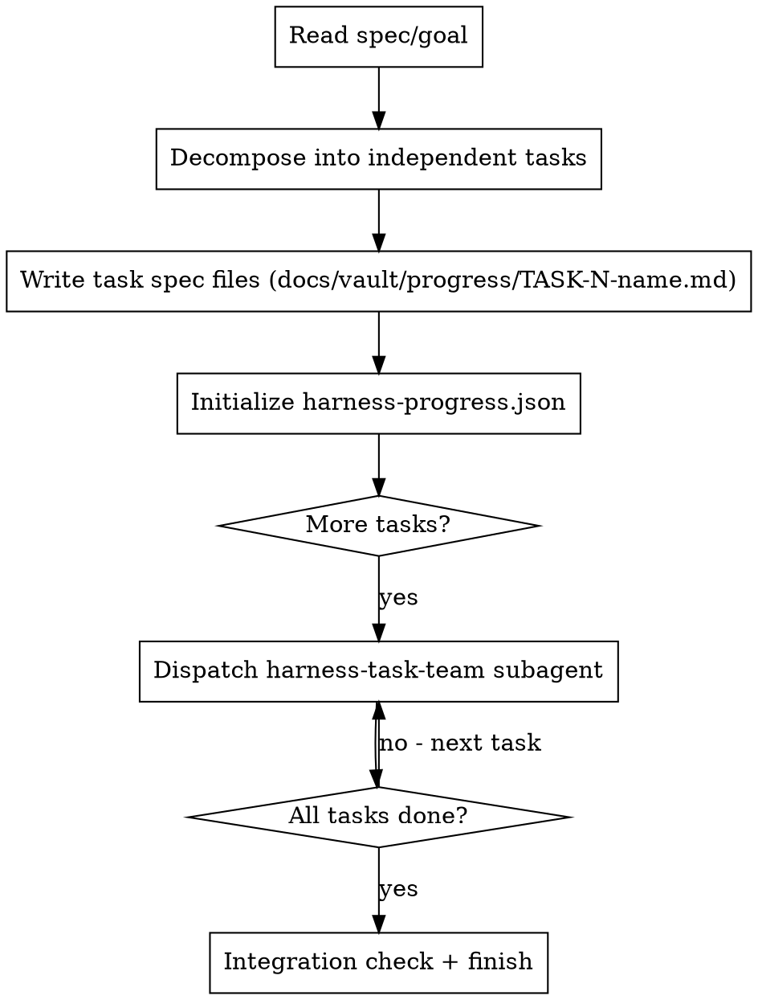

# Harness Orchestrate

Decompose a goal into task specs, then dispatch one `harness-task-team` subagent per task. Main session only decomposes — all implementation, testing, and review happen in subagents.

**Core principle:** Main session = task decomposition only. Preserve context by keeping all work in subagents.

## When to Use

- Starting implementation of a new feature, pipeline stage, or component
- You have a spec or goal but not yet a task breakdown
- Multiple independent tasks can be parallelized or sequenced

**Not for:** Single-task work or tightly-coupled sequential tasks (use `superpowers:subagent-driven-development` instead).

## The Process



## State Files: Source of Truth

Before dispatching any subagent, create/update two state files in `docs/vault/progress/`:

### `docs/vault/progress/harness-progress.json`

This is the machine-readable source of truth for task status. It is written once by the orchestrator and updated only by task team subagents — they may only update the `status` and `summary` fields. Specs are immutable: **no subagent may remove or edit task definitions**, only mark them complete.

```json
{
  "goal": "Short description of the overall goal",
  "created": "ISO-8601 timestamp",
  "tasks": [
    {
      "id": "TASK-1",
      "name": "short-name",
      "spec_file": "docs/vault/progress/TASK-1-short-name.md",
      "status": "pending",
      "summary": null,
      "commit": null,
      "test_count": null,
      "review_issues_found": null
    }
  ]
}
```

**Status values:** `pending` | `in-progress` | `complete` | `blocked`

### `docs/vault/progress/harness-progress.txt`

Human-readable log. The orchestrator writes the initial entry; each subagent appends to it. Never overwrite — always append.

```
[ORCHESTRATOR] Goal decomposed into N tasks. Task specs written.
```

## Task Spec Format

Write each task spec to `docs/vault/progress/TASK-N-name.md`:

```markdown
# Task N: [Name]

## Goal
[1-2 sentence purpose]

## Sprint Contract
### Deliverables
- [Concrete artifact 1]
- [Concrete artifact 2]

### Success Criteria
- [ ] [Testable criterion 1]
- [ ] [Testable criterion 2]
- [ ] All tests pass
- [ ] No regressions

## Context
[Architectural context: where this fits, dependencies, relevant files]

## Constraints
- [What NOT to build - YAGNI boundaries]
- [Existing patterns to follow]

## Test Strategy
[Prefer E2E/integration tests. Describe what behaviors need to be verified.]
```

## Dispatching Task Teams

For each task, dispatch a `harness-task-team` subagent:

```
Agent tool:
  description: "Task N: [name] — test -> review -> implement -> review"
  prompt: |
    Use the harness-task-team skill to execute this task.
    Task spec: [paste full content of docs/vault/progress/TASK-N-name.md]
    Progress JSON: docs/vault/progress/harness-progress.json (update your task's entry when done)
    Progress log: docs/vault/progress/harness-progress.txt (append your summary when done)
    Working directory: [absolute path]
```

## Decomposition Rules

**Good tasks:**
- Independent (no shared mutable state with other tasks)
- Single responsibility (one cohesive behavior)
- Testable end-to-end
- Completable in one subagent session

**Signs of bad decomposition:**
- Task requires output from another in-progress task
- "Integrate X and Y" as a task (integration = its own task after both)
- Tasks too large to test end-to-end in one pass

## Red Flags

- Don't implement anything in the main session — decompose only
- Don't dispatch multiple task teams for dependent tasks simultaneously
- Don't skip writing task spec files (subagents need them for adversarial review context)
- Sprint contract must include success criteria before dispatching
- Never edit `harness-progress.json` task specs after subagents have started — specs are immutable

## Integration with Other Skills

- **Before this:** `superpowers:brainstorming` -> `superpowers:writing-plans`
- **Task execution:** `harness-task-team`
- **After all tasks:** `superpowers:finishing-a-development-branch`
