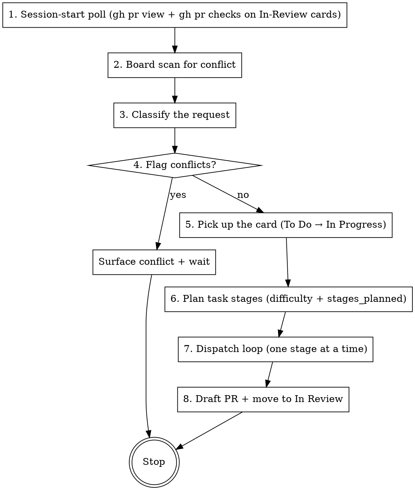

# Harness Orchestrate

The main-session orchestrator for workspaces using Obsidian kanban boards. On every user implementation request, this skill runs: poll active PRs, scan the board for conflicts, classify the request, pick up the card, plan stages, dispatch specialist subagents, keep the board and per-issue progress state in sync, raise a draft PR, and stop at the first HITL point.

**Core principle:** main session = orchestration only. All code changes, tests, reviews, and analysis happen in dispatched subagents. Main session reads artifacts from disk, branches on structured signals in `harness-progress.json`, moves cards, and dispatches.

## Invariants

- **Subagents cannot dispatch further subagents.** Only the main session calls the Agent tool. Every dispatch in this skill is from main session.
- **The board column is the source of truth for lifecycle state.** `status:` in `issue.md` frontmatter is allowed to drift; do not read it.
- **`In Review` ≡ HITL required.** A card is in that column iff the orchestrator is waiting on a human.
- **All state lives in the vault.** Per-issue `progress/` folder in `vault/projects/<Project>/issues/<slug>/progress/`. Do not write to `docs/tasks/` in the code workspace.
- **Orchestrator writes; humans drag.** Automated column moves only from this skill. Humans freely drag cards; tolerate drift on next read.

## When to use

This skill is the main-session default for any user request that is an **implementation/engineering task** — adding a feature, fixing a bug, refactoring, wiring up integration. The workspace's `CLAUDE.md` should declare this skill as the default behavior (see `workspace-claude-snippet.md`).

**Not for:** questions, discussions, code explanations, exploratory reads, documentation-only edits with no associated card.

## Flow per run



### 1. Session-start poll

Before acting on the user's request, run a short pass across every card currently in `In Review`:

- `gh pr view <n> --json state,reviews,comments` on each card's `PR:` URL
- `gh pr checks <n> --json name,state,conclusion` on the same
- `state == "MERGED"` → move card to `Done`, tick remaining sub-checklist boxes, append to `harness-progress.txt`
- New review comments since last poll (detect via stored-timestamp comparison in `harness-progress.json`) → summarize to `progress/TASK-N+1-review-feedback.md`, move card back to `In Progress`, note in the run's opening message
- CI check states rendered as a `CI:` bullet block on the card, replacing the previous block
- Any failing CI check → dispatch `ci-triage` subagent (see CI triage section)

If `gh` is unavailable, warn the user and proceed without polling.

### 2. Board scan for conflict

Read `vault/projects/<Project>/board.md`. For every card in `In Progress` and every `#P0` card in any column, and for high-priority (`#P0`/`#P1`) cards in `TODO`, open the issue note and hold `scope:` + `branch:` in context.

### 3. Classify the request

One-line statement to the user before any dispatch:

- **"Existing card."** Request maps to a specific card (user named one, or orchestrator identified an obvious match). Work inside that issue folder.
- **"New card."** Request is a tracked unit of work not yet on the board. Create the card + folder (via `prd-to-obsidian-kanban`'s card template) before dispatching anything.
- **"No card."** Request is trivial (single-file rename, one-line fix, typo). Orchestrator proceeds without a card; say so explicitly.
- **"PRD — deferring to `prd-to-obsidian-kanban`."** Request is a multi-slice feature. Delegate to that skill to create the cards, then return to this one for a single slice.

### 4. Flag conflicts

If the current request's scope overlaps an in-flight card's `scope:` or would conflict with its branch, surface the conflict in plain language and ask the user how to proceed (park the current request, coordinate, or ignore). Do not dispatch anything until the user decides.

### 5. Pick up the card

In the same message that makes the first dispatch:

- Move the card's line from `## To Do` to `## In Progress` on the board (single `Edit`).
- Create `vault/projects/<Project>/issues/<slug>/progress/` if missing.
- Cut a git branch: `git checkout -b feat/<slug>` in the code workspace.
- Write `branch: feat/<slug>` on the card body line below the card title.
- Update the `branch:` field in `issue.md` frontmatter.
- Seed `progress/harness-progress.json` from the task breakdown (see schema in `harness-task-team/SKILL.md`).
- Append to `progress/harness-progress.txt`: `[ORCHESTRATOR] Picked up. Branch: feat/<slug>. Stages planned: <list>.`

### 6. Plan task stages

Classify the task's `difficulty` and write `stages_planned` + `stages_reason` to the JSON. Default stage plans by difficulty:

| Level | Default stages_planned | Meaning |
|---|---|---|
| `trivial` | `["impl", "pr-draft"]` | Mechanical edit. Reason required. |
| `simple` | `["tests", "test-review", "impl", "code-review", "pr-draft"]` | Standard TDD. Default for most tasks. |
| `moderate` | `["architect", "tests", "test-review", "impl", "code-review", "pr-draft"]` | Touches a contract or crosses one module boundary. |
| `complex` | `["architect", "tests", "test-review", "impl", "spec-compliance", "code-review", "pr-draft"]` | Cross-module, new contracts, or multi-component. Often split into multiple tasks first. |

These are defaults, not rules. Deviate when `stages_reason` can justify it (e.g., `"impl-first: requirement shape unclear until implemented"`). Always write a non-empty `stages_reason` — silent deviation is the failure mode.

**Architect consultation mode** (optional, before finalizing the plan): if borderline, dispatch the `architect` specialist with the task spec and ask for a recommended `difficulty` + `stages_planned`. Architect writes `progress/TASK-N-architect-consultation.md`. Read it, decide, then finalize. Consultation does not write `contract.md`.

**Populate the card's sub-checklist** from `stages_planned`. Each box: `- [ ] <stage-name> — [[issues/<slug>/progress/<artifact>]]`. Artifact mapping:

- `architect` → `contract.md`
- `tests` → `TASK-N-test-writer-report.md`
- `test-review` → `TASK-N-test-review.md`
- `impl` → `harness-progress.json`
- `spec-compliance` → `TASK-N-spec-compliance.md`
- `code-review` → `TASK-N-code-review.md`
- `pr-draft` → `pr-draft.md`

### 7. Dispatch loop

For each task in the issue, for each stage in `stages_planned`, walk the per-task playbook in `harness-task-team/SKILL.md`. After every subagent return:

1. Read the updated task entry in `harness-progress.json` (structured signal).
2. Read the subagent's prose report (context).
3. Branch:
   - `status: complete` → tick the card's stage box, advance `stage_index`, dispatch next stage.
   - `last_verdict: gaps-found | issues-found` → re-dispatch the upstream role with the review as input.
   - `status: blocked` → consult the escalation branch table.

In the same message as the subagent return, perform the board edit (tick box / move column). Never defer card updates to a later message.

### Escalation branch table

| `blocker.kind` | Orchestrator action |
|---|---|
| `needs-contract-change` | Re-dispatch architect (contract mode) with the blocker's report as input. Architect updates `progress/contract.md`. Re-dispatch the original role against the updated contract. |
| `task-too-complex` | Split: write N new sub-task specs to `progress/`, grow the card's sub-checklist, dispatch sub-tasks sequentially. If splits are large enough to be independent cards, create them on the board instead. |
| `needs-human-decision` | Move card to `In Review`, post the question as a `> [!question]` callout in `issue.md`, append to `harness-progress.txt`, stop the run. |
| `needs-different-specialist` | Pick a different specialist from the workspace roster and re-dispatch. If none suitable, escalate as `needs-human-decision`. |
| `other` | Treated as `needs-human-decision`. |

### 8. Draft PR + move to In Review

When the final `pr-draft` stage is reached:

- `git push -u origin feat/<slug>`
- `gh pr create --draft --title "<title>" --body "$(cat progress/pr-draft.md)"`
- Write `PR: <url>` on the card body.
- Tick the `pr-draft` box.
- Move the card from `In Progress` to `In Review` (same `Edit`).
- Append to `harness-progress.txt`: `[ORCHESTRATOR] Draft PR raised: <url>. Card moved to In Review.`
- Stop. Do not pick up the next card in this run.

## CI monitoring

The session-start poll (step 1) calls `gh pr checks` on every In-Review card's PR and updates the `CI:` block on the card in place. When any check is failing:

1. Fetch logs: `gh run view <run-id> --log-failed > /tmp/run-<id>.log`
2. Dispatch `ci-triage` specialist with the task spec, the failing logs, and the relevant test source.
3. Triage writes `progress/TASK-N-ci-triage.md` with verdict `flake | regression | new-bug | infrastructure`, updates `harness-progress.json`.

Branch on verdict:

- `flake` → `gh run rerun --failed <run-id>`. Annotate card bullet: `e2e-tests (flaky — rerun)`. If the rerun fails identically, auto-escalate to `regression`.
- `regression` → move card back to `In Progress`, dispatch implementer with the failing logs + triage report as input.
- `new-bug` → move card back to `In Progress`, dispatch test-writer to add a covering test, then implementer.
- `infrastructure` → surface to user; card stays in `In Review`; no code action.

**Optional continuous CI monitoring between sessions.** On first draft-PR-raise in a workspace, surface an opt-in: register a cron via the `schedule` skill that runs the session-start poll every 5 minutes while `In Review` is non-empty. The cron deregisters itself when `In Review` empties. If the user declines, session-start polling remains the only poll.

## Board-edit mechanics

- Multiple column moves or box ticks in one run fold into a single `Edit` on `board.md`.
- `kanban-plugin: board` frontmatter and column headers (`## Backlog`, `## To Do`, etc.) are preserved byte-for-byte. Only checklist lines and card-body lines move or change.
- Never silently abandon a card in `In Progress`. Anything the orchestrator stops working on goes back to `TODO` with a note in `harness-progress.txt`.

## Specialist taxonomy

Each workspace declares its specialists. The orchestrator reads the roster at the start of each run and dispatches by role name.

- **Location:** `vault/projects/<Project>/specialists/<role>.md`. Sits next to `architecture.md` and `decisions/`.
- **Mandatory roles:** `architect`, `test-writer`, `test-reviewer`, `implementer`, `code-reviewer`, `ci-triage`.
- **File shape:** frontmatter declaring `model:` (default `haiku` for engineering roles, `opus` for architect), and a prompt body.
- **Fallback:** `harness-task-team/specialists-baseline/<role>.md` — the skill-shipped baseline. Dispatch logic tries workspace-specific first, falls back to the baseline.

Dispatch pseudocode:

```
role_file = vault/projects/<Project>/specialists/<role>.md
if not exists:
    role_file = ~/workspace/skills/harness-task-team/specialists-baseline/<role>.md
model = frontmatter(role_file).model or default_for(role)
prompt = body(role_file) + task_context_placeholders_filled_in
Agent(description=..., prompt=prompt, model=model)
```

## Model policy

- **Orchestrator:** Opus (expectation — main session runs Opus by default; not enforced by this skill).
- **Architect:** Opus (declared in the specialist template).
- **Engineering roles** (`test-writer`, `implementer`, `test-reviewer`, `code-reviewer`, `ci-triage`): Haiku by default. Workspaces override per-role if a project demands Sonnet.
- **"Too complex" is not solved by model upgrade.** If a task returns `blocker.kind: task-too-complex`, the orchestrator splits — does not re-dispatch the same task at a higher model tier.

## Red flags

- Don't implement anything in the main session — decompose and dispatch.
- Don't dispatch multiple role-agents for the same task in parallel.
- Don't skip writing task spec files — subagents need them for review context.
- Don't skip writing `stages_reason` when deviating from defaults.
- Don't edit task spec fields (`id`, `name`, `spec_file`) in `harness-progress.json` after subagents have started.
- Don't pick up a second card in the same run — stop at In Review after step 8.
- Don't write anywhere outside `vault/projects/<Project>/issues/<slug>/progress/` for per-issue state.

## Integration with other skills

- **Before this:** `superpowers:brainstorming` → `superpowers:writing-plans` (for spec'ing large features). Output of those flows should land as an issue or PRD, then this skill picks up.
- **Delegates to:** `prd-to-obsidian-kanban` when the request is a multi-slice PRD.
- **Walks through:** `harness-task-team` as its per-task playbook.
- **Sets up with:** `init-obsidian-kanban-project` (first-time project scaffolding), `migrate-flat-issues-to-folders` (one-shot migration from older vault layouts).
