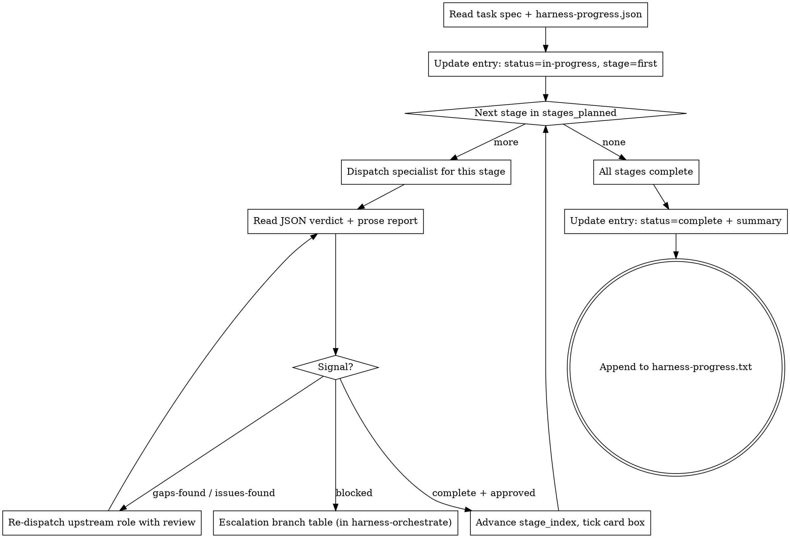

# Harness Task Team

The per-task playbook for the main-session orchestrator. For one task inside one card, walk through the stages declared in `stages_planned` — dispatch the specialist for each stage, read the JSON verdict, branch on it, advance the card.

**Core principle:** GAN-inspired generator-evaluator. The evaluator is adversarial by design — skepticism is not a bug, it's the feature. The orchestrator alternates between generator roles (test-writer, implementer, architect) and evaluator roles (test-reviewer, code-reviewer) per the declared `stages_planned`.

**This is a playbook, not a subagent skill.** The main-session orchestrator reads this file and performs the dispatches itself. No "task team coordinator" subagent exists. Subagents cannot dispatch further subagents.

## The team

| Stage | Role | Artifact |
|---|---|---|
| `architect` | Architect | `progress/contract.md` (contract mode) or `progress/TASK-N-architect-consultation.md` (consultation mode) |
| `tests` | Test Writer | Tests in the codebase + `progress/TASK-N-test-writer-report.md` |
| `test-review` | Adversarial Test Reviewer | `progress/TASK-N-test-review.md` + JSON `last_verdict` |
| `impl` | Implementer | Code + commit in the branch |
| `spec-compliance` | Spec Compliance Reviewer | `progress/TASK-N-spec-compliance.md` |
| `code-review` | Adversarial Code Reviewer | `progress/TASK-N-code-review.md` + JSON `last_verdict` |
| `pr-draft` | Orchestrator itself | `progress/pr-draft.md` + PR raised |
| `ci-triage` | CI Triage (on failure) | `progress/TASK-N-ci-triage.md` |

## Per-task flow



## Task entry JSON schema

Lives at `vault/projects/<Project>/issues/<slug>/progress/harness-progress.json`.

```json
{
  "goal": "<from issue.md title>",
  "created": "<ISO-8601>",
  "tasks": [
    {
      "id": "TASK-1",
      "name": "short-name",
      "spec_file": "progress/TASK-1-spec.md",

      "difficulty": "trivial | simple | moderate | complex",
      "difficulty_reason": "<one-line — why the orchestrator chose this>",

      "stages_planned": ["tests", "test-review", "impl", "code-review", "pr-draft"],
      "stages_reason": "<one-line — why this ordering/set>",

      "stage": "<current — must appear in stages_planned>",
      "stage_index": 0,

      "status": "pending | in-progress | complete | blocked",
      "last_verdict": null,
      "blocker": null,

      "summary": null,
      "commit": null,
      "test_count": null,
      "review_issues_found": null
    }
  ]
}
```

**Field ownership:**

- **Immutable after task starts** (`id`, `name`, `spec_file`): never edited.
- **Orchestrator-mutable** (`stages_planned`, `stages_reason`, `difficulty`, `difficulty_reason`): main session may rewrite mid-flight; must append a log note to `harness-progress.txt` when it does.
- **Subagent-mutable** (per-role, their entry only): `stage`, `status`, `last_verdict`, `blocker`, `summary`, `commit`, `test_count`, `review_issues_found`.

**`blocker` shape** (null unless `status == "blocked"`):

```json
{
  "kind": "needs-contract-change | task-too-complex | needs-human-decision | needs-different-specialist | other",
  "summary": "<one-line>",
  "report_file": "progress/TASK-N-<role>-report.md"
}
```

**`last_verdict` values** (reviewers only): `"approved" | "gaps-found" | "issues-found"`.

## Difficulty → default stage plan

| Level | Default `stages_planned` | Meaning |
|---|---|---|
| `trivial` | `["impl", "pr-draft"]` | Mechanical / rename / one-line edit. No tests, no review. Rarely justified — reason required. |
| `simple` | `["tests", "test-review", "impl", "code-review", "pr-draft"]` | Standard TDD. Default for most tasks. |
| `moderate` | `["architect", "tests", "test-review", "impl", "code-review", "pr-draft"]` | Touches a contract or crosses one module boundary. Architect up-front. |
| `complex` | `["architect", "tests", "test-review", "impl", "spec-compliance", "code-review", "pr-draft"]` | Cross-module, new contracts, multi-component. Often split first; complexity applies per-task after split. |

Defaults, not rules. Common justified deviations (always write `stages_reason`):

- `["impl", "tests", "test-review", "code-review", "pr-draft"]` — impl first when requirement under-specified; tests lock in observed behavior.
- `["architect", "impl", "pr-draft"]` — shape prototype for PR discussion; tests follow after HITL.
- `["tests", "impl", "pr-draft"]` — mechanical change; code review adds no value.

## Re-planning mid-flight

The orchestrator may rewrite `stages_planned` after a task starts — e.g., architect consultation reveals unexpected complexity and adds a `spec-compliance` stage. When it does, append to `progress/harness-progress.txt`:

```
[TASK-N] stages_planned rewritten: <old list> -> <new list>. Reason: <one line>.
```

Update `stage_index` consistently — if the current stage is still in the new list, keep its index; if it's been removed, move to the nearest downstream stage.

## Role prompt templates

Shipped baseline templates in `./specialists-baseline/`:

- `architect.md` — supports both modes; mode passed as a dispatch argument.
- `test-writer.md` — RED-phase test authoring (inherits from `superpowers:test-driven-development`).
- `test-reviewer.md` — adversarial test review.
- `implementer.md` — makes tests pass; commits.
- `code-reviewer.md` — adversarial code review.
- `ci-triage.md` — classifies CI failures.
- Spec-compliance reuses `superpowers:subagent-driven-development`'s `spec-reviewer-prompt.md`.

Workspaces override by dropping a matching file at `vault/projects/<Project>/specialists/<role>.md`. Orchestrator prefers workspace override when present; falls back to baseline otherwise.

### Reviewer output contract (same for test-review, code-review, spec-compliance)

Every reviewer writes TWO things before returning:

1. **JSON update** to `progress/harness-progress.json` — set `last_verdict` on the current task entry:
   - `"approved"` — no gaps / no issues found
   - `"gaps-found"` — test review only; some success criterion uncovered
   - `"issues-found"` — code review / spec compliance; implementation defect
2. **Prose report** to `progress/TASK-N-<role>.md` — evidence, specific gaps/issues, suggested fixes.

A report file without a matching JSON verdict update is incomplete — orchestrator re-dispatches.

### Engineer / architect output contract

Generator roles (test-writer, implementer, architect) write:

1. **JSON update** — `stage`, `status`, and (for implementer) `commit`, `test_count`.
2. **Prose artifact** appropriate to the role (test-writer-report, implementation commit, contract.md).

If blocked, set `status: "blocked"` and populate `blocker` with `kind` + `summary` + `report_file`.

## Dispatching

From main session. Pseudocode for one stage:

```
role = current stage
role_file = vault/projects/<Project>/specialists/<role>.md
             or harness-task-team/specialists-baseline/<role>.md (fallback)
model = frontmatter(role_file).model
prompt = body(role_file) filled with:
  - task spec path: progress/TASK-N-spec.md
  - progress JSON path: progress/harness-progress.json
  - task id: TASK-N
  - issue folder: vault/projects/<Project>/issues/<slug>/
  - upstream artifact (if re-dispatching from review): path to review report
  - branch: feat/<slug>
Agent(description=f"{role} for TASK-N: {name}", prompt=prompt, model=model)
```

After the subagent returns, the orchestrator reads the updated JSON entry and the prose report, then branches per the flowchart above.

## Red flags

- **Never dispatch `impl` before `test-review` returns `approved`** (unless `stages_planned` explicitly puts impl before tests, and `stages_reason` justifies it).
- **Never skip a stage listed in `stages_planned`.** If the plan says review, review happens.
- **Never accept an `approved` verdict** without a non-empty JSON `last_verdict` AND a non-empty prose report. An empty review is a failed review — re-dispatch with a stricter prompt.
- **Never edit task spec fields** (`id`, `name`, `spec_file`) after work has started. Specs are immutable.
- **Never let test-writer and implementer share context** — they must be separate subagents so the implementer doesn't see how the tests were written.
- **Never call this playbook from inside a subagent.** If you are a dispatched subagent reading this file, stop — dispatches are main-session only.

## Report format

When the task is complete, update the entry's final state:

```json
{
  "id": "TASK-N",
  "status": "complete",
  "stage": "<last stage in stages_planned>",
  "stage_index": <len(stages_planned) - 1>,
  "summary": "One-sentence description of what was built",
  "commit": "abc1234",
  "test_count": 7,
  "review_issues_found": "2 issues found and fixed in test review; 1 critical issue fixed in code review"
}
```

Then append to `progress/harness-progress.txt`:

```
[TASK-N: name] COMPLETE — 7 tests, 2 test gaps fixed, 1 code issue fixed. Commit: abc1234.
```
