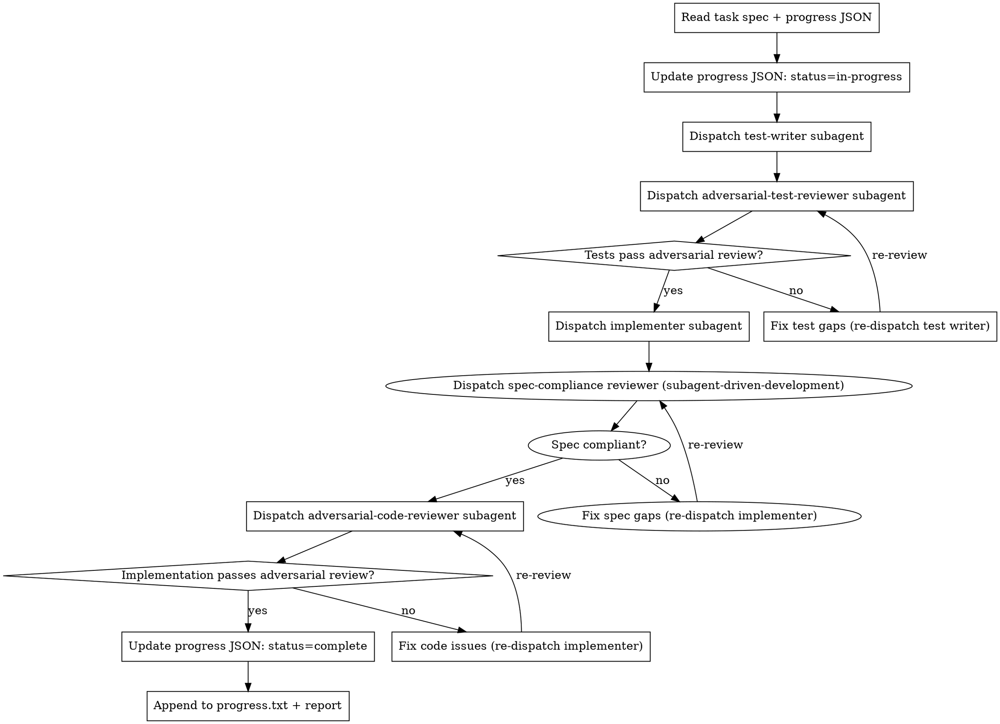

# Harness Task Team

Orchestrate a 4-agent team for one task. Agents communicate through files. Never share context directly — each agent reads artifacts from disk.

**Core principle:** GAN-inspired generator-evaluator. The evaluator is adversarial by design — skepticism is not a bug, it's the feature.

## The Team

| Agent | Role | Artifact |
|-------|------|----------|
| Test Writer | Writes E2E/integration tests (red, failing) | `tests/` |
| Adversarial Test Reviewer | Attacks the tests for gaps and false confidence | `docs/vault/progress/TASK-N-test-review.md` |
| Implementer | Makes tests pass, nothing more | Code + commit |
| Adversarial Code Reviewer | Attacks the implementation for bugs, missing cases | `docs/vault/progress/TASK-N-code-review.md` |

## The Process



## Progress Tracking

### At Task Start

Update `docs/vault/progress/harness-progress.json` — set your task's `status` to `"in-progress"`:

```json
{
  "id": "TASK-N",
  "status": "in-progress",
  "summary": null,
  "commit": null,
  "test_count": null,
  "review_issues_found": null
}
```

### At Task Completion

Update your task's entry in `docs/vault/progress/harness-progress.json` with final state:

```json
{
  "id": "TASK-N",
  "status": "complete",
  "summary": "One-sentence description of what was built",
  "commit": "abc1234",
  "test_count": 7,
  "review_issues_found": "2 issues found and fixed in test review; 1 critical issue fixed in code review"
}
```

Then append to `docs/vault/progress/harness-progress.txt`:

```
[TASK-N: name] COMPLETE — 7 tests (E2E+integration), 2 test gaps fixed, 1 code issue fixed. Commit: abc1234.
```

**Critical constraint:** You may only update the `status`, `summary`, `commit`, `test_count`, and `review_issues_found` fields. Never modify the task spec fields (`id`, `name`, `spec_file`). Specs are immutable.

## Dispatching Each Agent

| Step | Prompt template | Builds on |
|------|----------------|-----------|
| Test writer | `./test-writer-prompt.md` | `superpowers:test-driven-development` (RED phase) |
| Adversarial test reviewer | `./adversarial-test-reviewer-prompt.md` | — (new) |
| Implementer | `superpowers:subagent-driven-development`'s `./implementer-prompt.md` | unchanged |
| Spec compliance check | `superpowers:subagent-driven-development`'s `./spec-reviewer-prompt.md` | unchanged |
| Adversarial code reviewer | `./adversarial-code-reviewer-prompt.md` | `superpowers:requesting-code-review` + domain checks |

Run spec compliance **before** adversarial code review — same order as `subagent-driven-development`.

## Adversarial Reviewer Calibration

Reviewers default to leniency. Counter this explicitly in prompts:
- "Assume the tests are incomplete — your job is to find what they miss"
- "Assume the implementation has bugs — your job is to find them"
- "A review with no issues is a failed review unless you can prove exhaustive coverage"

## Red Flags

- **Never** dispatch implementer before test review passes
- **Never** skip a review stage — adversarial review is the whole point
- **Never** accept "looks good" without verifying the reviewer read actual code/tests (not reports)
- **Never** let test writer and implementer share context (they must be separate subagents)
- If reviewer finds nothing: dispatch again with stricter prompt before accepting
- **Never** edit task spec fields in `harness-progress.json` — only update status/result fields

## Report Format

When task is complete, report to orchestrator:

```
Task N: [name] — COMPLETE
Tests: [N tests, E2E/integration/unit breakdown]
Test review: [issues found -> fixed, or clean]
Implementation: [what was built, files changed]
Code review: [issues found -> fixed, or clean]
Commit: [SHA]
Progress JSON: updated
Progress log: appended
```
